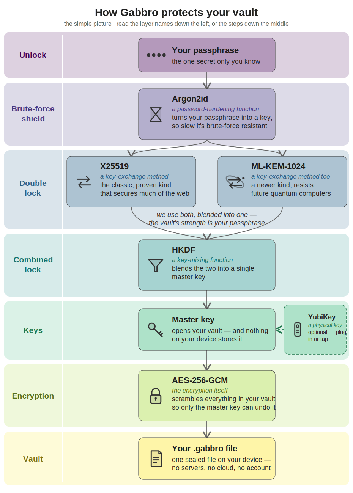

# Gabbro

A quantum-resistant password manager.

> **Status: Alpha.**
> All vault operations implemented and tested in Rust; Flutter UI complete.

---

## What is Gabbro?

Gabbro is a free, open-source password manager designed for users who
take security seriously. Your secrets are protected by memory-hard key
derivation (Argon2id) and AES-256 encryption — both resistant to
classical and quantum attack.

Named after the intrusive igneous rock — hard, stable, enduring.

### Key properties

- **Quantum-resistant by design** — vault security rests on Argon2id +
  AES-256-GCM, both quantum-resistant. New vaults derive the vault key
  straight from Argon2id (VERSION 11); an earlier X25519 + ML-KEM-1024
  layer was removed as non-load-bearing (ADR-018)
- **Hardware key (optional, recommended)** — FIDO2/YubiKey authentication; passphrase-only
  by default, with a minimum of two keys when keys are used (primary + backup)
- **Rust for all secrets** — every cryptographic operation lives in
  Rust; secrets never cross the Flutter/Rust bridge in plaintext
- **Local-first** — your vault lives on your device; sync is your
  choice and your responsibility
- **Localised** — UI available in many languages (EN, FR, DE, IT, ES, and more); follows system locale with in-app override
- **Multi-language passphrase generator** — wordlist library covering many languages; classic generator uses language-native character pools (Greek, Cyrillic, Hiragana/Katakana, Hangul, CJK)
- **In-app help** — offline help carousel; no external website or internet connection required
- **FOSS** — GPL-3.0-only licensed

---

## Tech Stack

| Layer | Technology |
|---|---|
| UI | Flutter (Dart) |
| Crypto & secrets | Rust |
| Bridge | flutter_rust_bridge v2 (FFI) |

The Flutter:Rust split follows a strict principle: if it touches a
secret, it lives in Rust. Everything else lives in Flutter.

---

## Target Platforms

| Platform | Target |
|---|---|
| Linux (Arch, Mint) | v1 |
| Android (F-Droid) | v1 |
| Windows | v2 (future) |

---

## Encryption

<p align="center">
  
</p>

*A plain-language overview. For the version-accurate detail, see the [full technical diagram](docs/artefacts/gabbro_crypto_stack_flow.svg).*

```
passphrase + random_salt
→ Argon2id (KDF)
→ HKDF-SHA256 (vault key; optional YubiKey factor)
→ AES-256-GCM (vault encryption)
→ encrypted vault body + auth tag
```

Quantum resistance comes from Argon2id + AES-256-GCM. New vaults
(VERSION 11) derive the vault key directly from Argon2id; an earlier
hybrid X25519 + ML-KEM-1024 key-exchange layer was removed as
non-load-bearing (ADR-018), and survives read-only to migrate older vaults.

Vault files use the `.gabbro` extension and are self-contained —
all parameters needed for decryption travel with the file.
Exports include a detached SHA-256 hash for integrity verification.

---

## Verifying Export Integrity

Every vault export produces two files:

```
vault.gabbro         — the encrypted vault
vault.gabbro.sha256  — detached SHA-256 hash
```

To verify the export has not been corrupted in transit or storage:

```bash
sha256sum -c vault.gabbro.sha256
```

A clean result prints `vault.gabbro: OK`. This follows the same
convention as Linux ISO verification and can be run before decryption
using any standard tool — no Gabbro installation required.

Note: the detached hash detects accidental corruption, not tampering —
anyone who alters the file can recompute it. Tamper detection is
AES-256-GCM's authentication tag, checked during decryption. The hash is
a UX complement that allows a corruption check *before* opening the vault.

---

## Contributors

- [Zabamund](https://github.com/Zabamund/) — project owner,
  architect, and lead developer
- [Claude.ai](https://claude.ai) — AI development partner

---

## Installation

> **Alpha release — for invited testers only.** The cryptographic
> implementation has not yet undergone external review. Do not store
> passwords you cannot afford to lose.

Download the latest release from the
[Releases](https://github.com/gabbro-foss/gabbro/releases) page,
or receive the artifact directly from the project owner.

### Linux (Arch, Debian trixie, Linux Mint)

Requires glibc ≥ 2.34 — satisfied by all current Arch, Debian stable,
and Mint installations.

```bash
tar -xzf gabbro-<version>-linux-x86_64.tar.gz
./bundle/gabbro
```

You can place the `bundle/` directory anywhere; the app is self-contained.

#### Verify the Linux build is genuine

The Linux tarball is signed with the project's OpenPGP (GPG) key — the same way
the Arch ISO is. Each release ships a detached signature file
(`gabbro-<version>-linux-x86_64.tar.gz.asc`) alongside the tarball.

The signing key's fingerprint is:

```
369B E2CE CFD0 A528 7155  895A 4775 4EEE 7F9A ABFC
```

Import the public key, confirm the fingerprint matches, then verify the download:

```bash
# 1. Import the public signing key
gpg --import <<'KEY'
-----BEGIN PGP PUBLIC KEY BLOCK-----

mDMEajgxtBYJKwYBBAHaRw8BAQdAG3DemW7XMQSbcWx5koOsGKaBrkF4HMTq+73w
e3t2Fli0IUdhYmJybyBSZWxlYXNlcyA8Z2FiYnJvQHR1dGEuY29tPoiWBBMWCgA+
FiEENpvizs/QpShxVYlaR3VO7n+aq/wFAmo4MbQCGwMFCQPCZwAFCwkIBwIGFQoJ
CAsCBBYCAwECHgECF4AACgkQR3VO7n+aq/z/8QEA3uN7NLlAOOuBr/K7ReMALsxn
QWIUZ395/gfdwJJCsNcA/17lsivsdnCGt8uQogCXF/DUwCwupmT4Fe5+fCOrHbgH
uDgEajgxtBIKKwYBBAGXVQEFAQEHQDvu7ROg/IQiWFO7EH/kUvFQi0/RipJPdEJ9
xgH07nR1AwEIB4h+BBgWCgAmFiEENpvizs/QpShxVYlaR3VO7n+aq/wFAmo4MbQC
GwwFCQPCZwAACgkQR3VO7n+aq/wc8AEA8n4s8olL3l5l28uAHhpwxTUyo7D3TzIq
emmgXWd/v3wA/32c5BlwHzo6dt803Q0tK2neIwrFqKr5dBCZM2nDDK4E
=lC0o
-----END PGP PUBLIC KEY BLOCK-----
KEY

# 2. Confirm the fingerprint printed matches the one above
gpg --fingerprint gabbro@tuta.com

# 3. Verify the tarball against its signature
gpg --verify gabbro-<version>-linux-x86_64.tar.gz.asc gabbro-<version>-linux-x86_64.tar.gz
```

A `Good signature` line means the build is authentic. GPG may add a warning that
the key is "not certified with a trusted signature" — that is expected and not a
failure; it only means you have not personally signed the key. The fingerprint
match above is your trust anchor.

A bad or missing signature means the file is **not** an official Gabbro build —
do not run it.

### Android

1. Enable **Install from unknown sources** on your device:
   - Android 8+: Settings → Apps → Special app access → Install unknown apps → select your file manager → Allow
2. Transfer the APK for your device to it (USB, email, or file transfer). Pick by device type:
   - `gabbro-<version>-android-arm64-v8a.apk` — modern phones (almost everyone; use this if unsure)
   - `gabbro-<version>-android-armeabi-v7a.apk` — old 32-bit phones
   - `gabbro-<version>-android-x86_64.apk` — emulators / Chromebooks
3. Tap the APK file in your file manager to install.

Tested on Android 11+ (including GrapheneOS). YubiKey authentication requires a YubiKey 5 series key (USB-A/C for all devices; NFC where supported).

#### Verify the APK is genuine

Before installing, confirm the APK was signed by the project's key — this proves
it has not been tampered with or repackaged. The signing certificate's public
SHA-256 fingerprint is:

```
Package: app.gabbro.gabbro
SHA-256: 0F:0A:B8:1B:9B:B8:F0:21:68:25:83:73:17:C6:49:F3:64:F4:47:B0:D0:93:5B:FA:1B:67:82:A9:FF:3A:1D:2C
```

- **GrapheneOS / Accrescent users:** install [AppVerifier](https://github.com/soupslurpr/AppVerifier),
  open it, pick Gabbro (or the APK file), and check the reported hash matches the one above.
- **Any platform:** run `apksigner verify --print-certs gabbro-<version>-android-<abi>.apk` and compare the
  `SHA-256` certificate digest (`<abi>` is whichever file you downloaded — `arm64-v8a`, `armeabi-v7a` or `x86_64`). All three per-ABI APKs are signed by the same key and share this fingerprint.

A mismatch means the file is **not** an official Gabbro build — do not install it.

---

## Known hardware quirks

**NumLock LED switches off when you plug in a YubiKey (Linux/X11).** On an X11
session, inserting a YubiKey turns the keyboard's NumLock indicator light off —
you may notice this when unlocking a passphrase + YubiKey vault. Your numeric
keypad keeps working normally (the digits still type); only the LED is affected.

This is **not a Gabbro behaviour** and Gabbro cannot prevent it: a YubiKey
presents a USB keyboard interface (the one that types one-time passwords when you
touch it), and X11 resets the keyboard's indicator lights whenever any keyboard
device is plugged in. The same happens with many USB keyboards. It is cosmetic —
nothing to fix and nothing lost. If the wrong LED bothers you, your desktop's
"turn NumLock on at login/after hotplug" option (e.g. `numlockx`) re-syncs it.

---

## Development

### Prerequisites

- [Flutter](https://docs.flutter.dev/get-started/install)
- [Rust](https://rustup.rs/) (`rustup toolchain install stable`)
- [flutter_rust_bridge_codegen](https://crates.io/crates/flutter_rust_bridge_codegen)

On Arch Linux, install Flutter via the AUR (`flutter-bin`) and Rust
via pacman (`pacman -S rustup`). Add yourself to the `flutter` group:

```bash
sudo usermod -aG flutter $USER
# log out and back in
```

### Run locally

from `gabbro` root folder:

```bash
flutter pub get
flutter run -d linux   # Linux desktop
flutter run -d android # Android device/emulator
```

### Build

from `gabbro` root folder:

```bash
flutter build linux --release   # Linux desktop
./build/linux/x64/release/bundle/gabbro # Run on linux
flutter build apk --split-per-abi --release   # Android (per-ABI APKs)
adb install build/app/outputs/flutter-apk/app-arm64-v8a-release.apk # install on a modern phone
```

### Tests

```bash
# Rust unit tests
cd rust && cargo test

# Flutter tests
flutter test

# Real-FFI suites (need the release Rust lib; -j 1 as the Rust session is global)
cd rust && cargo build --release --lib && cd ..
dart test integration_test/ -j 1
```

---

## Documentation

- [`docs/ARCHITECTURE.md`](docs/ARCHITECTURE.md) — full architecture reference
- [`docs/VAULT_SYNC.md`](docs/VAULT_SYNC.md) — syncing one vault across devices; worked example with Syncthing (Linux) and Syncthing-Fork (Android)
- [`docs/AI_SECURITY_AUDIT.md`](docs/AI_SECURITY_AUDIT.md) — AI-assisted security review of the crypto and vault modules (Claude Opus 4.7, 2026-05-31)
- [`docs/AI_SECURITY_AUDIT_REVIEW.md`](docs/AI_SECURITY_AUDIT_REVIEW.md) — second-pass review of that audit (Claude Fable 5, 2026-06-11)
- [`docs/AI_SECURITY_AUDIT_3.md`](docs/AI_SECURITY_AUDIT_3.md) — third pass: import parsers, FFI/JNI bridge, Kotlin, Dart leak channels (Claude Opus 4.8, 2026-06-25)
- [`docs/decisions/`](docs/decisions/) — architectural decision records (ADRs)

---

## Licence

GPL-3.0-only — see [`LICENSE`](LICENSE) for details.

---

## Contributing

This project is in early development. Contributions, feedback, and
security review are welcome.

**Before contributing, please open an issue** to discuss what you have
in mind. This applies to bug reports, feature requests, and proposed
changes alike.

### On agentic contributions

Gabbro is a security-critical project. All contributions must be
human-authored and human-reviewed.

- **Agentic pull requests are not accepted.** PRs authored or
  generated by AI agents will be closed without review. This is not
  a reflection on AI tools generally — it is a recognition that
  security-sensitive code requires human understanding, human
  accountability, and human judgement at every step. 
  (See: [the curl project's experience with AI contributions](https://daniel.haxx.se/blog/2024/01/02/the-i-in-llm-stands-for-intelligence/) for context on why this matters.)
- **Agents are welcome to open issues.** If an AI assistant has
  identified a bug, a security concern, or a reasonable feature
  request, a respectfully written issue is a genuine contribution.
  Please state clearly that the issue was AI-assisted.

Human reviewers are scarce; their attention is valuable. Please
respect that.
