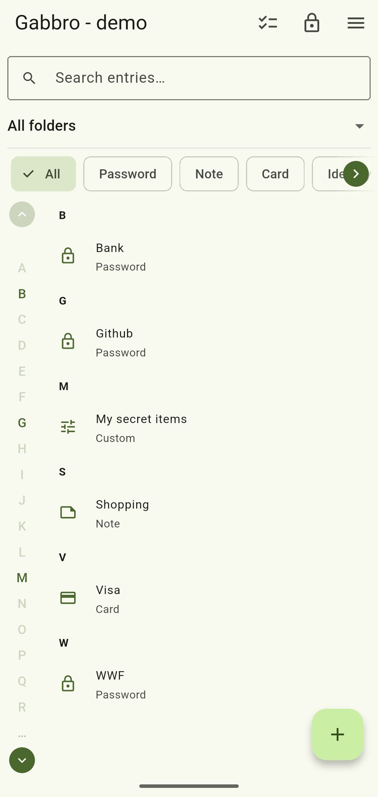
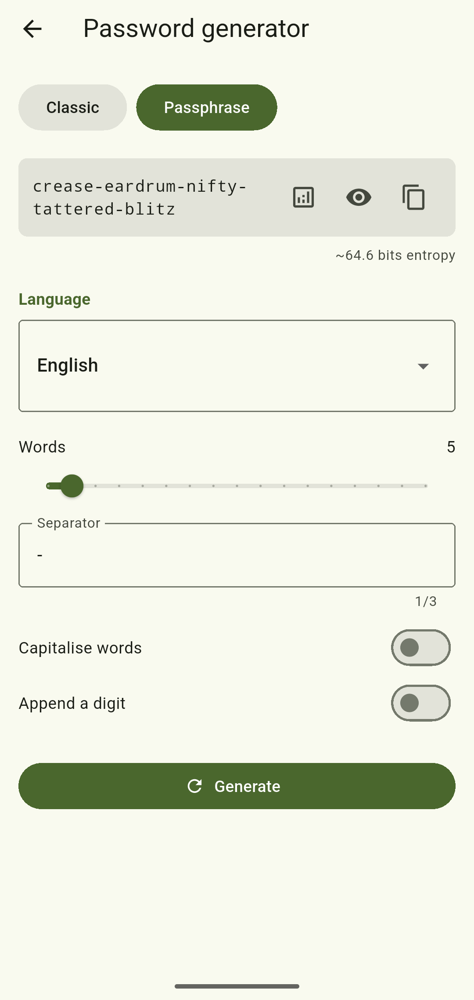
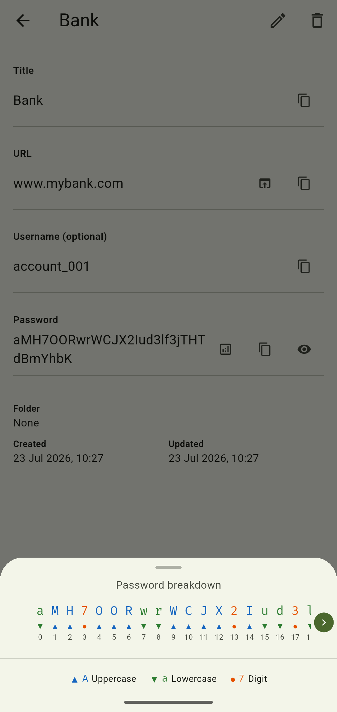
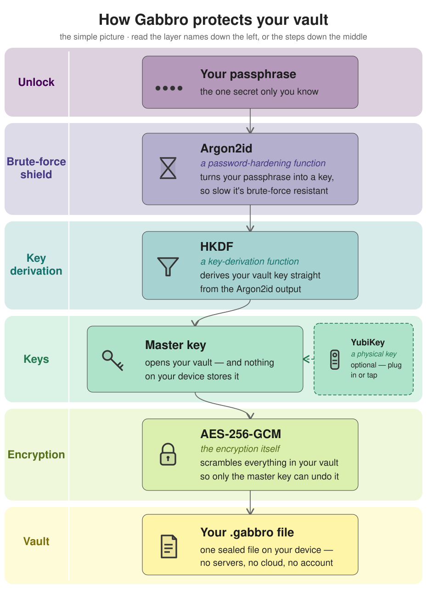

# Gabbro

A quantum-resistant password manager.

> **Status: Alpha.**
> All vault operations implemented and tested in Rust; Flutter UI complete.

---

## What is Gabbro?

Gabbro is a free, open-source password manager designed for users who
take security seriously. Your secrets are protected by memory-hard key
derivation (Argon2id) and AES-256 encryption — both resistant to
classical and quantum attack.

Named after the intrusive igneous rock — hard, stable, enduring.

### Key properties

- **Quantum-resistant by design** — vault security rests on Argon2id +
  AES-256-GCM, both quantum-resistant. Vaults derive the vault key
  straight from Argon2id (VERSION 11)
- **Hardware key (optional, recommended)** — FIDO2/YubiKey authentication; passphrase-only
  by default, with a minimum of two keys when keys are used (primary + backup)
- **Rust for all keys** — every cryptographic operation lives in Rust;
  keys never cross the Flutter/Rust bridge. Secrets you view, generate
  or autofill do reach Flutter in plaintext to be displayed
- **Local-first** — your vault lives on your device; sync is your
  choice and your responsibility (for example with [syncthing](https://syncthing.net/))
- **Localised** — UI available in many languages (EN, FR, DE, IT, ES, and more);
 follows system locale with in-app override
- **Multi-language passphrase generator** — wordlist library covering many languages;
 classic generator uses language-native character pools (Greek, Cyrillic, Hiragana/Katakana, Hangul, CJK)
- **In-app help** — offline help carousel; no external website or internet connection required
- **FOSS** — GPL-3.0-only licensed

---

## Screenshots

<table>
  <tr>
    <td width="33%"></td>
    <td width="33%"></td>
    <td width="33%"></td>
  </tr>
  <tr>
    <td align="center">Your vault</td>
    <td align="center">Passphrase generator</td>
    <td align="center">Password breakdown</td>
  </tr>
</table>

---

## Tech Stack

| Layer | Technology |
|---|---|
| UI | Flutter (Dart) |
| Crypto & secrets | Rust |
| Bridge | flutter_rust_bridge v2 (FFI) |

The Flutter:Rust split follows a strict principle: if it touches a key,
it lives in Rust. Everything else lives in Flutter.

---

## Target Platforms

| Platform | Target |
|---|---|
| Linux (Arch, Mint) | v1 |
| Android (incl. GrapheneOS) | v1 |
| Windows | v2 (future) |

---

## Encryption

<p align="center">
  
</p>

*A plain-language overview. For the version-accurate detail, see the [full technical diagram](docs/artefacts/gabbro_crypto_stack_flow.svg).*

```
passphrase + random_salt
→ Argon2id (KDF)
→ HKDF-SHA256 (vault key; optional YubiKey factor)
→ AES-256-GCM (vault encryption)
→ encrypted vault body + auth tag
```

Quantum resistance comes from Argon2id + AES-256-GCM. Vaults (VERSION 11)
derive the vault key directly from Argon2id.
VERSION 11 is the oldest format this build opens — an older vault is refused
without being modified, and can be upgraded via
[docs/VAULT_UPGRADE_PATH.md](docs/VAULT_UPGRADE_PATH.md).

Vault files use the `.gabbro` extension and are self-contained —
all parameters needed for decryption travel with the file.
Exports include a detached SHA-256 hash for integrity verification.

---

## Verifying Export Integrity

Every vault export produces two files:

```
vault.gabbro         — the encrypted vault
vault.gabbro.sha256  — detached SHA-256 hash
```

To verify the export has not been corrupted in transit or storage:

```bash
sha256sum -c vault.gabbro.sha256
```

A clean result prints `vault.gabbro: OK`. This follows the same
convention as Linux ISO verification and can be run before decryption
using any standard tool — no Gabbro installation required.

Note: the detached hash detects accidental corruption, not tampering —
anyone who alters the file can recompute it. Tamper detection is
AES-256-GCM's authentication tag, checked during decryption. The hash is
a UX complement that allows a corruption check *before* opening the vault.

---

## Contributors

- [Zabamund](https://github.com/Zabamund/) — project owner,
  architect, and lead developer
- [Claude.ai](https://claude.ai) — AI development partner

---

## Installation

> **Alpha release** — the cryptographic implementation `rust/src/crypto`
> has not yet undergone external review. It is provided as-is, without
> warranty, as stated in the GPL-3.0.

Release files are on the
[Releases](https://github.com/gabbro-foss/gabbro/releases) page. Pick your
platform below.

### Linux

Two ways to install: a **native package** (recommended — it adds a menu entry and
a `gabbro` command, pulls in the dependencies, and is removed cleanly by your
package manager), or the **portable tarball** (any distribution, no root, run from
a folder). All builds require glibc ≥ 2.34, satisfied by all current Arch, Debian
stable, and Mint installations.

#### Arch Linux (and derivatives) — AUR

```bash
yay -S gabbro-bin      # or: paru -S gabbro-bin
```

Installs system-wide to `/usr` with a menu entry and the `gabbro` command on your
PATH; your AUR helper resolves the dependencies and updates it with the rest of
your system. `gabbro-bin` repackages the official release build — it does not
recompile from source.

#### Debian / Linux Mint — APT repository

Add the repo once; every later release then arrives through `apt upgrade` and
Mint's Update Manager. Install the signing key, add the source, install:

```bash
sudo install -d /etc/apt/keyrings && sudo curl -fsSL https://gabbro-foss.github.io/gabbro-apt/gabbro-archive-keyring.gpg -o /etc/apt/keyrings/gabbro.gpg
```

```bash
sudo tee /etc/apt/sources.list.d/gabbro.sources >/dev/null <<'EOF'
Types: deb
URIs: https://gabbro-foss.github.io/gabbro-apt
Suites: stable
Components: main
Architectures: amd64
Signed-By: /etc/apt/keyrings/gabbro.gpg
EOF
```

```bash
sudo apt update && sudo apt install gabbro
```

Installs system-wide to `/usr` with a menu entry and the `gabbro` command; `apt`
resolves the dependencies.

One-off alternative (no auto-update): download `gabbro_<version>_amd64.deb` from
the Releases page, then `sudo apt install ./gabbro_<version>_amd64.deb`. It
upgrades in place when you install a newer one.

#### Any distribution — portable tarball

```bash
tar -xzf gabbro-<version>-linux-x86_64.tar.gz
./bundle/gabbro
```

Self-contained: place `bundle/` anywhere and run it in place. No root — but also no
menu entry and no `gabbro` on your PATH; that system integration is what the
packages add. Nothing resolves dependencies for you either — install the runtime
libraries the packages would have pulled in:

- **Arch:** `sudo pacman -S --needed libfido2 libcbor pcsclite gtk3 xdg-desktop-portal xdg-desktop-portal-gtk`
- **Debian / Mint:** `sudo apt install libfido2-1 libcbor0.10 libpcsclite1 libgtk-3-0t64 xdg-desktop-portal xdg-desktop-portal-gtk`

Website passkeys need `/dev/uhid` access; the AUR and APT packages set this up
for you, the tarball does not. Without it, passkeys silently do nothing while
everything else works. One-time setup (skip if you don't use passkeys):

```bash
echo 'KERNEL=="uhid", SUBSYSTEM=="misc", TAG+="uaccess"' | sudo tee /etc/udev/rules.d/70-gabbro-uhid.rules
echo 'uhid' | sudo tee /etc/modules-load.d/gabbro-uhid.conf
sudo udevadm control --reload && sudo modprobe uhid && sudo udevadm trigger --name-match=uhid
```

#### Uninstall

| Installed via | Remove with |
|---|---|
| AUR | `sudo pacman -Rns gabbro-bin` |
| APT / `.deb` | `sudo apt remove gabbro` |
| tarball | delete the `bundle/` folder |

If you added the APT repo, also delete `/etc/apt/sources.list.d/gabbro.sources`
and `/etc/apt/keyrings/gabbro.gpg`. If you did the tarball passkey setup,
remove it too (optionally `sudo modprobe -r uhid` to unload the module until
reboot):

```bash
sudo rm /etc/udev/rules.d/70-gabbro-uhid.rules /etc/modules-load.d/gabbro-uhid.conf && sudo udevadm control --reload
``` If you bound a custom shortcut for auto-type,
remove it too — it would now point at a deleted binary and silently do nothing.

**Your vaults and settings are not removed** — they live in
`~/.local/share/app.gabbro.gabbro/` (vaults) and `~/.config/gabbro/` (settings),
separate from the app files. To erase everything, delete those two directories as
well. (Android differs: uninstalling the app *does* delete its vaults, because app
data lives in private storage — export a `.gabbro` backup first.)

#### Set up auto-type (optional)

Gabbro ships a small `gabbro-autotype` helper. Nothing is bound by default, so
auto-type does nothing until you bind it to a shortcut yourself. Once you do,
pressing that key types the login **currently showing in Gabbro** into **whatever
window has focus** — username, Tab, password, Enter. No copy-paste.

**You choose the entry; Gabbro cannot.** A browser does not tell the window
manager which site is on screen, and Gabbro will never ship a browser extension
to find out [docs/decisions/ADR-008-no-browser-extension.md](docs/decisions/ADR-008-no-browser-extension.md). 
So it does no site matching and cannot warn you when the entry is
wrong for the page — whatever login is showing is what gets typed, and submitted.
It stays showing until you pick another or the vault locks. Check the entry before
you press your key.

Its path depends on how you installed:

- **Package (AUR / `.deb`):** `/usr/lib/gabbro/gabbro-autotype`
- **Tarball:** `<where-you-extracted>/bundle/gabbro-autotype`

qtile (`~/.config/qtile/config.py`):

```python
Key([mod, "control"], "g", lazy.spawn("/usr/lib/gabbro/gabbro-autotype")),
```

Cinnamon / Linux Mint: Menu → **Keyboard** → **Shortcuts** → **Custom
Shortcuts** → **Add custom shortcut**, with the full path as the command.

Requires an X11 session (not Wayland) and Gabbro running and unlocked with a
login showing. Full instructions, other desktops, and troubleshooting:
[`docs/AUTOTYPE_AND_AUTOFILL.md`](docs/AUTOTYPE_AND_AUTOFILL.md).

#### Verify the Linux build is genuine

The Linux tarball is signed with the project's OpenPGP (GPG) key — the same way
the Arch ISO is. Each release ships a detached signature file
(`gabbro-<version>-linux-x86_64.tar.gz.asc`) alongside the tarball.

The signing key's fingerprint is:

```
369B E2CE CFD0 A528 7155  895A 4775 4EEE 7F9A ABFC
```

Import the public key, confirm the fingerprint matches, then verify the download:

```bash
# 1. Import the public signing key
gpg --import <<'KEY'
-----BEGIN PGP PUBLIC KEY BLOCK-----

mDMEajgxtBYJKwYBBAHaRw8BAQdAG3DemW7XMQSbcWx5koOsGKaBrkF4HMTq+73w
e3t2Fli0IUdhYmJybyBSZWxlYXNlcyA8Z2FiYnJvQHR1dGEuY29tPoiWBBMWCgA+
FiEENpvizs/QpShxVYlaR3VO7n+aq/wFAmo4MbQCGwMFCQPCZwAFCwkIBwIGFQoJ
CAsCBBYCAwECHgECF4AACgkQR3VO7n+aq/z/8QEA3uN7NLlAOOuBr/K7ReMALsxn
QWIUZ395/gfdwJJCsNcA/17lsivsdnCGt8uQogCXF/DUwCwupmT4Fe5+fCOrHbgH
uDgEajgxtBIKKwYBBAGXVQEFAQEHQDvu7ROg/IQiWFO7EH/kUvFQi0/RipJPdEJ9
xgH07nR1AwEIB4h+BBgWCgAmFiEENpvizs/QpShxVYlaR3VO7n+aq/wFAmo4MbQC
GwwFCQPCZwAACgkQR3VO7n+aq/wc8AEA8n4s8olL3l5l28uAHhpwxTUyo7D3TzIq
emmgXWd/v3wA/32c5BlwHzo6dt803Q0tK2neIwrFqKr5dBCZM2nDDK4E
=lC0o
-----END PGP PUBLIC KEY BLOCK-----
KEY

# 2. Confirm the fingerprint printed matches the one above
gpg --fingerprint gabbro@tuta.com

# 3. Verify the tarball against its signature
gpg --verify gabbro-<version>-linux-x86_64.tar.gz.asc gabbro-<version>-linux-x86_64.tar.gz
```

A `Good signature` line means the build is authentic. GPG may add a warning that
the key is "not certified with a trusted signature" — that is expected and not a
failure; it only means you have not personally signed the key. The fingerprint
match above is your trust anchor.

A bad or missing signature means the file is **not** an official Gabbro build —
do not run it.

The Debian `.deb` is signed with the same key — verify it the same way:

```bash
gpg --verify gabbro_<version>_amd64.deb.asc gabbro_<version>_amd64.deb
```

The AUR package needs no separate check: its `PKGBUILD` pins the release tarball's
SHA-256, so installing it verifies against the same signed tarball above.

#### File dialogs on bare window managers and in sandboxes

Native file dialogs go through the XDG desktop portal over the DBus session bus.
If the portal cannot be reached, Gabbro does not crash — dialogs degrade to a
message inviting you to type the path instead.

- **Bare window managers** (e.g. qtile) install the portal but never start it.
  Start it from session init, e.g. in `~/.xinitrc`: `/usr/lib/xdg-desktop-portal &`.
- **Hand-rolled `bwrap` sandboxes** must forward the Wayland socket (or no window
  appears at all) and the session bus (or the portal is unreachable):

  ```
  bwrap … \
    --ro-bind "$XDG_RUNTIME_DIR/$WAYLAND_DISPLAY" "$XDG_RUNTIME_DIR/$WAYLAND_DISPLAY" \
    --setenv WAYLAND_DISPLAY "$WAYLAND_DISPLAY" \
    --ro-bind "$XDG_RUNTIME_DIR/bus" "$XDG_RUNTIME_DIR/bus" \
    --setenv DBUS_SESSION_BUS_ADDRESS "$DBUS_SESSION_BUS_ADDRESS" \
    …
  ```

  `xdg-desktop-portal` plus a backend such as `xdg-desktop-portal-gtk` must be
  running in the session.

### Android

1. Enable **Install from unknown sources** on your device:
   - Android 8+: Settings → Apps → Special app access → Install unknown apps → select your file manager → Allow
2. Transfer the APK for your device to it (USB, email, or file transfer). Pick by device type:
   - `gabbro-<version>-android-arm64-v8a.apk` — modern phones (almost everyone; use this if unsure)
   - `gabbro-<version>-android-armeabi-v7a.apk` — old 32-bit phones
   - `gabbro-<version>-android-x86_64.apk` — emulators / Chromebooks
3. Tap the APK file in your file manager to install.

Tested on Android 11+ (including GrapheneOS). YubiKey authentication requires a YubiKey 5 series key (USB-A/C for all devices; NFC where supported).

#### Auto-updates with Obtainium (recommended on GrapheneOS)

Manual APK installs do not auto-update. [Obtainium](https://github.com/ImranR98/Obtainium)
installs and updates Gabbro straight from its GitHub Releases, keeping the project's own
signature. It is popular with GrapheneOS users.

1. Install Obtainium.
2. Tap **Add App** and paste the repo URL: `https://github.com/gabbro-foss/gabbro`
3. Turn on **Include prereleases** (current builds are alpha, marked pre-release on GitHub).
4. Set the APK filter to your device's ABI so the right file is picked: `arm64-v8a`
   (modern phones), `armeabi-v7a` (old 32-bit), or `x86_64` (emulators / Chromebooks).
5. Install. Obtainium then flags each new release for a one-tap update.

Verify the signing fingerprint on first install (below); Obtainium pins it thereafter.

#### Verify the APK is genuine

Before installing, confirm the APK was signed by the project's key — this proves
it has not been tampered with or repackaged. The signing certificate's public
SHA-256 fingerprint is (package name, then fingerprint — copy both lines as they
are, AppVerifier pastes them directly):

```
app.gabbro.gabbro
0F:0A:B8:1B:9B:B8:F0:21:68:25:83:73:17:C6:49:F3:64:F4:47:B0:D0:93:5B:FA:1B:67:82:A9:FF:3A:1D:2C
```

- **GrapheneOS / Accrescent users:** install [AppVerifier](https://github.com/soupslurpr/AppVerifier),
  open it, pick Gabbro (or the APK file), and check the reported hash matches the one above.
  To compare by paste instead, copy the two lines above verbatim — AppVerifier rejects them
  if a `Package:` or `SHA-256:` label is included.
- **Any platform:** run `apksigner verify --print-certs gabbro-<version>-android-<abi>.apk` and compare the
  `SHA-256` certificate digest (`<abi>` is whichever file you downloaded — `arm64-v8a`, `armeabi-v7a` or `x86_64`). All three per-ABI APKs are signed by the same key and share this fingerprint.

A mismatch means the file is **not** an official Gabbro build — do not install it.

---

## Keyboard shortcuts (Linux)

Desktop-only; also listed in-app under the vault menu → **Keyboard shortcuts**.

| Shortcut | Action |
|---|---|
| `Ctrl+L` | Lock the vault |
| `Ctrl+N` | New entry |
| `Ctrl+M` | Open the menu |
| `Ctrl+Q` | Lock and quit (asks first) |
| `Ctrl+F` | Focus search |
| `Ctrl+Shift+F` | Search all fields |
| `Tab` / `Shift+Tab` | Move between regions (search, folders, filters, list, detail) |
| `↑` `↓` `←` `→` | Move within the focused region |
| `Enter` / `Space` | Activate the focused control |
| `Esc` | Leave the focused region; again to close a dialog or go back |

There is deliberately **no copy shortcut** — copying a secret stays an explicit,
auto-clearing action.

---

## Known hardware quirks

**NumLock LED switches off when you plug in a YubiKey (Linux/X11).** On an X11
session, inserting a YubiKey turns the keyboard's NumLock indicator light off —
you may notice this when unlocking a passphrase + YubiKey vault. Your numeric
keypad keeps working normally (the digits still type); only the LED is affected.

This is **not a Gabbro behaviour** and Gabbro cannot prevent it: a YubiKey
presents a USB keyboard interface (the one that types one-time passwords when you
touch it), and X11 resets the keyboard's indicator lights whenever any keyboard
device is plugged in. The same happens with many USB keyboards. It is cosmetic —
nothing to fix and nothing lost. If the wrong LED bothers you, your desktop's
"turn NumLock on at login/after hotplug" option (e.g. `numlockx`) re-syncs it.

---

## Development

### Prerequisites

- [Flutter](https://docs.flutter.dev/get-started/install)
- [Rust](https://rustup.rs/) (`rustup toolchain install stable`)
- [flutter_rust_bridge_codegen](https://crates.io/crates/flutter_rust_bridge_codegen)

On Arch Linux, install Flutter via the AUR (`flutter-bin`) and Rust
via pacman (`pacman -S rustup`). Add yourself to the `flutter` group:

```bash
sudo usermod -aG flutter $USER
# log out and back in
```

### Run locally

from `gabbro` root folder:

```bash
flutter pub get
flutter run -d linux   # Linux desktop
flutter run -d android # Android device/emulator
```

### Build

from `gabbro` root folder:

```bash
flutter build linux --release   # Linux desktop
./build/linux/x64/release/bundle/gabbro # Run on linux
flutter build apk --split-per-abi --release   # Android (per-ABI APKs)
adb install build/app/outputs/flutter-apk/app-arm64-v8a-release.apk # install on a modern phone
```

### Tests

```bash
# Rust unit tests
cd rust && cargo test

# Flutter tests
flutter test

# Real-FFI suites (need the release Rust lib; -j 1 as the Rust session is global)
cd rust && cargo build --release --lib && cd ..
dart test integration_test/ -j 1
```

---

## Documentation

**Using Gabbro**

- [`docs/AUTOTYPE_AND_AUTOFILL.md`](docs/AUTOTYPE_AND_AUTOFILL.md) — setting up auto-type on Linux and autofill on Android
- [`docs/VAULT_SYNC.md`](docs/VAULT_SYNC.md) — syncing one vault across devices; worked example with Syncthing (Linux) and Syncthing-Fork (Android)
- [`docs/VAULT_UPGRADE_PATH.md`](docs/VAULT_UPGRADE_PATH.md) — vault file format versions and what happens to an older vault

**Project**

- [`docs/ARCHITECTURE.md`](docs/ARCHITECTURE.md) — full architecture reference
- [`docs/SECURITY.md`](docs/SECURITY.md) — security overview: what Gabbro protects against and what it does not
- [`docs/BUILD_AND_RELEASE.md`](docs/BUILD_AND_RELEASE.md) — build environment, runtime dependencies, and the release process
- [`docs/MAINTENANCE.md`](docs/MAINTENANCE.md) — vendored data and pins that need periodic refresh
- [`docs/decisions/`](docs/decisions/) — architectural decision records (ADRs)

**AI development and review**

- [`docs/AI_DEVELOPMENT_PROCESS.md`](docs/AI_DEVELOPMENT_PROCESS.md) — is Gabbro "vibe-coded"? notes on how it is actually built
- [`docs/AI_AUTHORSHIP_AND_IP.md`](docs/AI_AUTHORSHIP_AND_IP.md) — who owns AI-written code: authorship and IP notes
- [`docs/AI_SECURITY_AUDIT.md`](docs/AI_SECURITY_AUDIT.md) — AI-assisted security review of the crypto and vault modules (Claude Opus 4.7, 2026-05-31)
- [`docs/AI_SECURITY_AUDIT_REVIEW.md`](docs/AI_SECURITY_AUDIT_REVIEW.md) — second-pass review of that audit (Claude Fable 5, 2026-06-11)
- [`docs/AI_SECURITY_AUDIT_3.md`](docs/AI_SECURITY_AUDIT_3.md) — third pass: import parsers, FFI/JNI bridge, Kotlin, Dart leak channels (Claude Opus 4.8, 2026-06-25)

---

## Licence

GPL-3.0-only — see [`LICENSE`](LICENSE) for details.

---

## Contributing

This project is in early development. Contributions, feedback, and
security review are welcome.

**Before contributing, please open an issue** to discuss what you have
in mind. This applies to bug reports, feature requests, and proposed
changes alike.

### On agentic contributions

Gabbro is a security-critical project. All contributions must be
human-authored and human-reviewed.

- **Agentic pull requests are not accepted.** PRs authored or
  generated by AI agents will be closed without review. This is not
  a reflection on AI tools generally — it is a recognition that
  security-sensitive code requires human understanding, human
  accountability, and human judgement at every step. 
  (See: [the curl project's experience with AI contributions](https://daniel.haxx.se/blog/2024/01/02/the-i-in-llm-stands-for-intelligence/) 
  for context on why this matters.)
- **Agents are welcome to open issues.** If an AI assistant has
  identified a bug, a security concern, or a reasonable feature
  request, a respectfully written issue is a genuine contribution.
  Please state clearly that the issue was AI-assisted.

Human reviewers are scarce; their attention is valuable. Please
respect that.
